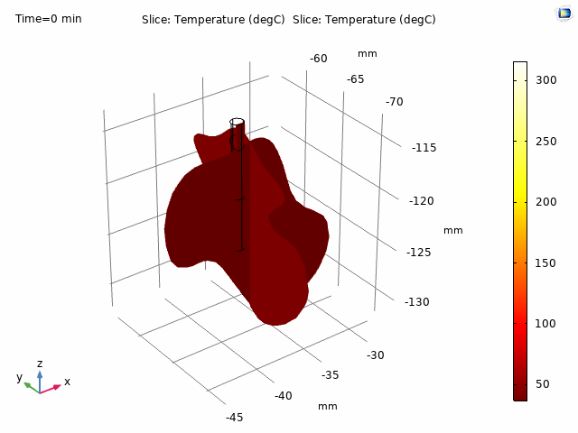

# 🫁 3D Modelling and Ablation of Lung Tumour

  
  
  

This repository contains the complete undergraduate project work on **3D segmentation, reconstruction, and radiofrequency ablation of lung tumours** using medical imaging data. It involves developing a custom image processing algorithm in Python, validating against gold-standard software like Materialise MIMICS and 3D Slicer, and simulating thermal ablation using COMSOL Multiphysics.

---

## Repository Overview

| Folder                         | Description                                                                 |
|--------------------------------|-----------------------------------------------------------------------------|
| `notebooks/`                   | Jupyter notebooks for preprocessing, segmentation, and 3D reconstruction   |
| `comsol_simulation/`           | COMSOL `.mph` files, probe geometry, and thermal simulation results         |
| `mimics_segmentation/`         | MIMICS `.mcs` project file for lung tumour segmentation                     |
| `results/`                     | Rendered comparisons, statistical charts, and thermal simulation GIFs       |
| `reports/`                     | Project documentation including the final presentation                      |

---

## Project Highlights

- ✅ Developed a **semi-automated algorithm** for lung tumour segmentation using connected component analysis and K-means clustering.
- ✅ Reconstructed accurate **3D tumor models** from CT slices using the Marching Cubes algorithm.
- ✅ Validated segmentation quality against **Materialise MIMICS** and **3D Slicer** outputs.
- ✅ Simulated **radiofrequency ablation (RFA)** in COMSOL Multiphysics to study thermal spread and necrosis.
- ✅ Conducted statistical comparison on tumour volume estimation across 9 patient scans.

---

## Key Results

### Tumor Volume Accuracy

| Tool Used              | Tumor Volume Accuracy Compared to Clinical Ground Truth |
|------------------------|-------------------------------|
| Semi-Automated (Python)| 93%                           |
| MIMICS                 | 92%                           |
| 3D Slicer              | ~89% (manual + time-consuming)|

---

### Reconstruction Comparison

Comparison of tumour surface models for 3 patients across three platforms:

(A) Python Algorithm | (B) MIMICS | (C) 3D Slicer

---

### RF Ablation Thermal Simulation

The COMSOL model demonstrates heat propagation and tissue damage fraction over time, validating the effectiveness of probe positioning and voltage settings.

---

## Final Report

📎 [project_presentation.pdf](reports/project_presentation.pdf)

---

## Tech Stack

- Python (NumPy, Matplotlib, Scikit-image, OpenCV)
- COMSOL Multiphysics
- Materialise MIMICS
- 3D Slicer
- Jupyter Notebooks
